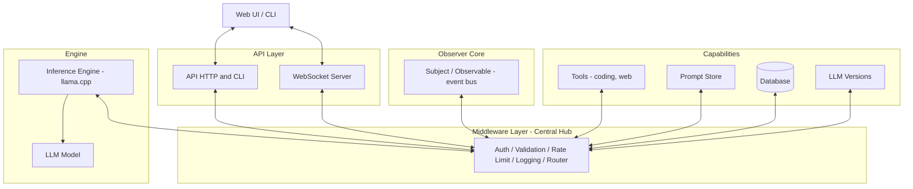
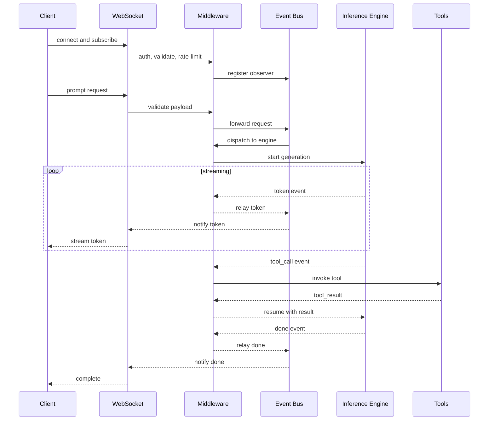
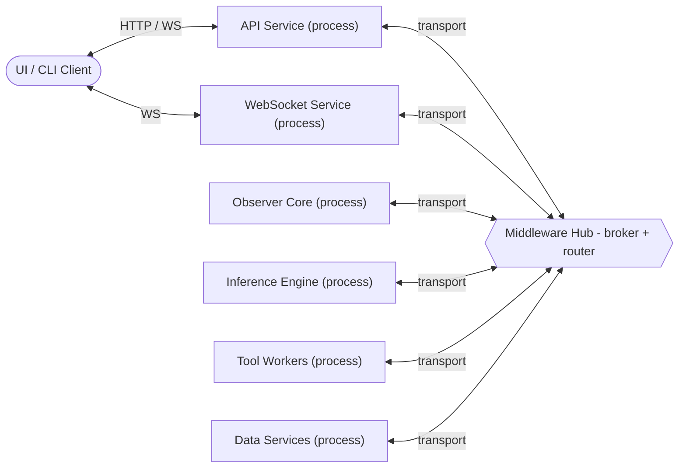
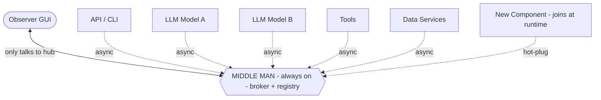
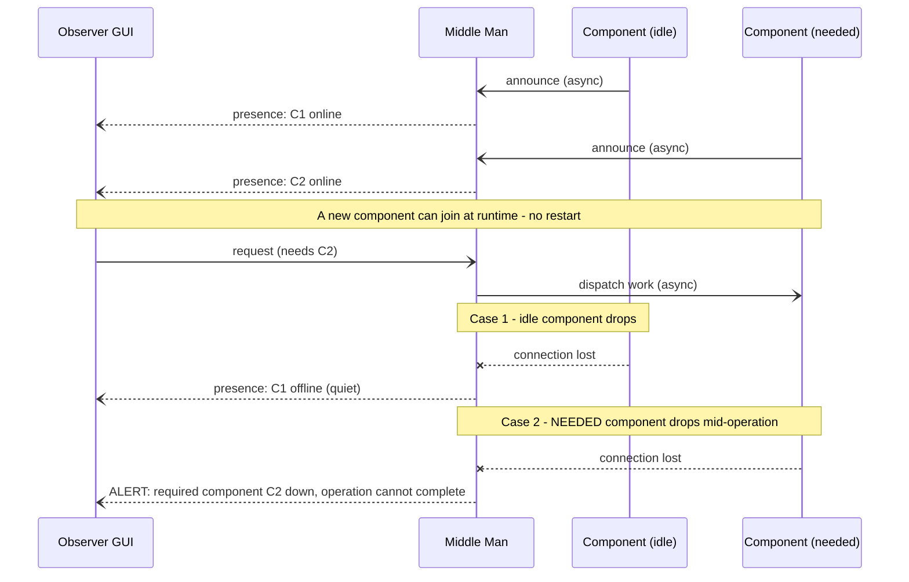
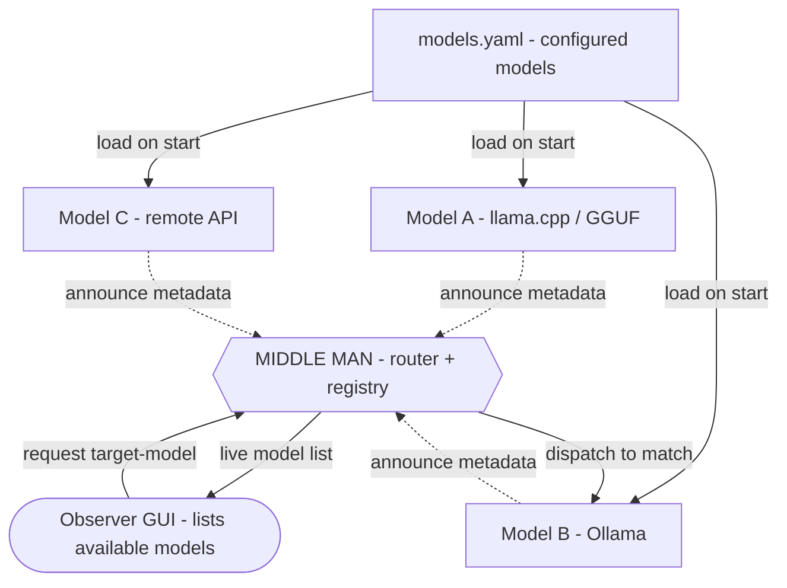
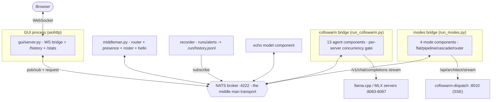

# Observer-based Local LLM Application — Architecture

A local-LLM application (llama.cpp / opencode style) built around a single always-on
**"middle man"** — a message broker + service registry that is the only mandatory process.
The **GUI talks only to the middle man**, and every component connects only to the middle man.
Communication is **fully asynchronous** (pub/sub, fire-and-forget, no heartbeat polling).
Components are **language-independent**, **fault-isolated** (one going down does not take the
system down), and **hot-pluggable** (added/removed at runtime). The GUI is an **Observer** that
reactively renders live system state from the broker's async event and presence streams.

> Preview in VS Code: open this file and press `Cmd+K V`.

## Component Architecture

## Observer Event Flow

## Design Patterns

This architecture combines several classic design patterns:

| Pattern | Where it appears | Role |
|---|---|---|
| **Observer / Pub-Sub** | `Subject / Observable` event bus ↔ subscribers (`WS`, `Tools`) | Inference emits events (tokens, status, tool-calls); subscribers react in real time. The core of the design. |
| **Mediator** | `Middleware Layer (Central Hub)` | Every component talks *through* the hub instead of directly to each other, centralizing routing and keeping components decoupled. |
| **Facade** | `API Layer` (`API HTTP and CLI`, `WebSocket Server`) | One simplified entry point for clients, hiding middleware + core + engine behind it. |
| **Chain of Responsibility** | Middleware concerns: Auth → Validation → Rate Limit → Logging → Router | Each stage processes a request and passes it along the pipeline. |
| **Strategy** *(implied)* | `Inference Engine` + `LLM Versions` | Swappable backend (llama.cpp ↔ opencode ↔ remote API) behind one interface. |
| **Command** *(implied)* | Tool flow: `tool_call` → `invoke tool` → `tool_result` | Each action is packaged as an object that is dispatched, executed, and returns a result. |
| **Repository** *(implied)* | `Prompt Store`, `Database`, `LLM Versions` | Uniform data-access abstraction behind the hub. |

**Note:** Observer and Mediator do overlapping coordination work here — the Mediator (middleware)
sits between the engine and the event bus, so events relay through the hub rather than publishing
directly. This is intentional, but it makes the middleware a single chokepoint to keep an eye on.

## Standalone Services

Each piece runs as its **own independent process** with its own entry point. They do not call
each other in-process — they communicate **through the Middleware hub over a transport**
(WebSocket / HTTP / message queue), using the validated **event schema as the contract**. This
lets any component be started, stopped, scaled, or replaced on its own.

| Service | Runs standalone as | Talks to hub via | Contract |
|---|---|---|---|
| **API / CLI** | HTTP server / CLI binary | HTTP or local socket | Request schema |
| **WebSocket Server** | WS daemon | WebSocket | Event schema |
| **Middleware Hub** | Broker / router process | — (it *is* the bus) | Routes all events |
| **Observer Core** | Event-bus process | hub transport | Event schema |
| **Inference Engine** | llama.cpp / opencode worker | hub transport | Inference request/event |
| **Tools** | Per-tool worker process | hub transport | Tool call/result |
| **Prompt Store / DB / Versions** | Data service | hub transport | Repository query/response |

### Deployment View

**Implications**
- Each service is independently deployable and testable in isolation (mock the hub transport).
- The contract is the **schema**, not a shared in-memory object — keep validation at every hub boundary.
- The hub must be running for the system to integrate; design it for restart/reconnect (services
  should reconnect and re-subscribe, not crash, if the hub bounces).
- Per the modular rule, each service stays in its own module/package with a thin transport adapter.

## Resilient Central Hub

The **middle man** (broker + registry) is the single always-on process. Every other piece is an
optional, independent client that connects asynchronously and **announces itself once** on connect.
There is **no heartbeat / polling** — presence is event-driven, derived from the broker's async
connect/disconnect events.

Dotted links mean "optional / may be absent" — if a component is not connected, the hub and every
other component keep running. The system never depends on all components being present.

## Dynamic Membership & Fault Isolation

All messages are asynchronous (`-)` send, `--)` async reply). A component announces on connect, a new
one can join at runtime, and two disconnect cases are handled differently: an **idle** component
dropping is silent, while a **needed** component dropping mid-operation triggers an alert to the GUI.

## Kubernetes Analogy

The design mirrors a Kubernetes-style control plane — but **event-driven instead of polled**.

| Kubernetes | This design |
|---|---|
| API server + etcd (always up) | The middle man (broker + registry) |
| Pods register / are scheduled | Components connect and async-announce |
| Dashboard observes cluster state | Observer GUI renders live state |
| One pod crashing ≠ cluster down | One component down ≠ system down |
| **Liveness/readiness probes (polling)** | **Async connect/disconnect events (no polling)** |

## Middle Man Technology

Recommended broker: **NATS** — a single tiny always-on binary with async pub/sub, polyglot clients
(40+ languages), free join/leave, and native async client connect/disconnect events (no heartbeat
needed). Optional JetStream adds durability. Lighter and better-fitting for a PC than Pulsar
(cluster-heavy), Redis (weak discovery), or RabbitMQ.

This pattern is not new — existing systems implement most of it:

| System | What it already provides |
|---|---|
| **MQTT brokers** (Mosquitto, EMQX) | **Last Will & Testament**: broker auto-publishes a message when a client drops — exactly the "notify on disconnect" behavior. |
| **ROS 2 / DDS** | Independent polyglot nodes, discovery middleware, live observer graph, "liveliness" QoS that notifies when a needed publisher disappears. |
| **NATS** | Lightest broker; async presence events; you add the dependency-aware alert logic. |

The **dependency-aware alert** ("notify only if the dropped component was *needed* for in-flight work")
is app logic the middle man owns regardless of which broker is chosen.

## Configurable Model Drop-in

LLM models are **configurable drop-in components**. Each model is its own process that connects to the
middle man and **announces its metadata** (name, backend, context length, quantization, capabilities).
A models config (e.g. `models.yaml`) drives which models load; the Observer GUI renders the live set as
selectable options; each request carries a **target-model** field and the router dispatches to the
matching model component. Pattern: **Strategy** (swappable backend) + **Registry** (dynamic catalog).

**Usable model components (existing tools):**

| Tool | Role as a model component |
|---|---|
| **Ollama** | Local drop-in by name; OpenAI-compatible API; loads GGUF on demand |
| **LiteLLM** | Config-driven catalog/router across many backends behind one API |
| **LocalAI** | Self-hosted, OpenAI-compatible, models defined by config |
| **vLLM / TGI** | High-throughput GPU serving; can host/switch models |

## Language Independence

Components are **polyglot** — each is a separate process/binary in any language, sharing **no library
or runtime**, only the broker's wire protocol and an agreed **message schema**. Define and version the
schema centrally (JSON Schema or protobuf) so any-language component can validate against it at the
broker boundary. The contract is the message on the wire, not shared code.

> Default: JSON Schema for simplicity; protobuf if you later want compact, strongly-typed messages.
> JetStream (NATS durability) is optional and not required for the core design.

---

# As-Built Implementation

The sections above are the original design. This section documents what was actually built and is
running. The scope is the **two pieces novel vs cofiswarm** — a single NATS broker "middle man" and
event-driven (no-heartbeat) presence — plus the observer GUI, recording, and bridges that connect the
live cofiswarm system (agents + orchestration modes) onto the bus.

## As-Built Components

## Subject Reference (`swarm.observer.*`)

| Subject | Direction | Payload | Purpose |
|---|---|---|---|
| `.announce` | component → bus | `Announce` | join / re-announce |
| `.goodbye` | component → bus | `Goodbye` | graceful leave |
| `.presence` | middleman → observers | `Presence` | online/offline updates |
| `.alert` | middleman → observers | `Alert` | needed-component-down / timeout |
| `.request` | observer → middleman | `InferRequest` | inference (req/reply) |
| `.roster` | observer → middleman | `RosterReply` | snapshot for late joiners |
| `.cancel` | observer → models | `Cancel` | abort an in-flight request |
| `.hello` | middleman → components | `Hello` | restart → re-announce |
| `.model.<name>` | middleman → model | `InferRequest` | per-model dispatch (req/reply) |
| `.tokens.<request_id>` | model → observers | `Token` | streamed tokens + final usage |

## Module Map

| Path | Responsibility |
|---|---|
| `bus/subjects.py` | subjects + Pydantic envelopes (mirrors cofiswarm `agent.json`) |
| `bus/nats_bus.py` | async NATS wrapper; request surfaces no-responders/timeout |
| `bus/presence.py` | event-driven presence registry (no heartbeat) |
| `bus/middleman.py` | router; slow≠down handling; roster; hello broadcast |
| `adapters/cofiswarm_model.py` | model component; sessions; cancel; EchoBackend |
| `adapters/llama_backend.py` | real llama/MLX streaming + usage + per-server gate |
| `adapters/dispatch_backend.py` | cofiswarm mode bridge via dispatch SSE |
| `recorder/{store,service,stats}.py` | JSONL history + per-model aggregates |
| `gui/server.py`, `gui/index.html` | aiohttp NATS↔browser bridge + UI |
| `run_*.py` | entry points (middleman, model, cofiswarm, modes, recorder, gui) |
| `scripts/{start_stack,supervise}.sh` | tmux startup + per-service auto-restart |
| `tests/` | 31 broker-free tests (pytest) |

## Operations

- All services run in tmux session **`observer`** (windows: nats, middleman, echo-fast, recorder, gui,
  cofiswarm, modes), each under `scripts/supervise.sh` (auto-restart, capped backoff).
- **Reboot survival:** launchd agent `~/Library/LaunchAgents/com.observer.stack.plist` runs
  `scripts/start_stack.sh` at login.
- **GUI:** http://127.0.0.1:8099 — grouped roster, live token streaming + metrics, Stop, sessions,
  History (replay), Stats.
- **Tests:** `python3 -m pytest tests/ -q` (no broker/network needed).
- **Resilience notes:** a *slow* model (TimeoutError) stays registered; only a *no-responder* is
  deregistered. The middleman is in-memory and re-populates via `hello` on restart. Agents sharing one
  llama server serialize through a per-server semaphore (`PER_SERVER_CONCURRENCY`).

